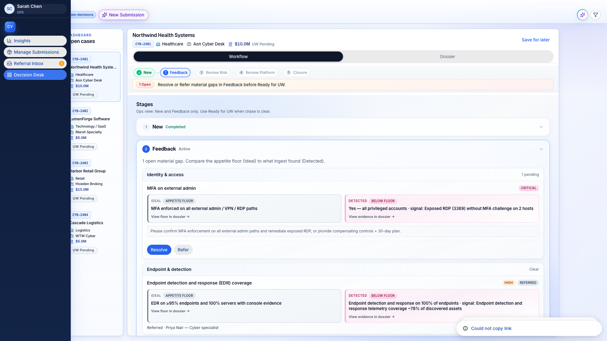
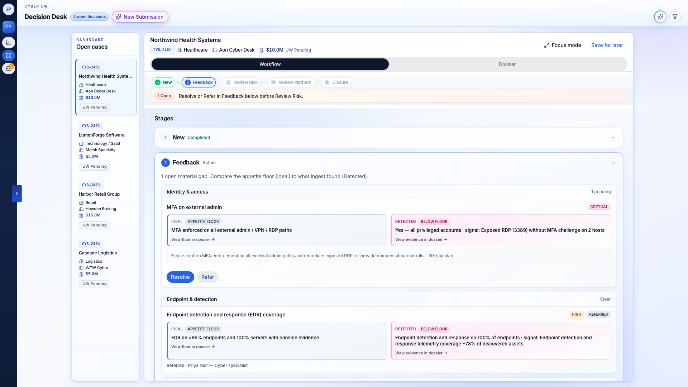
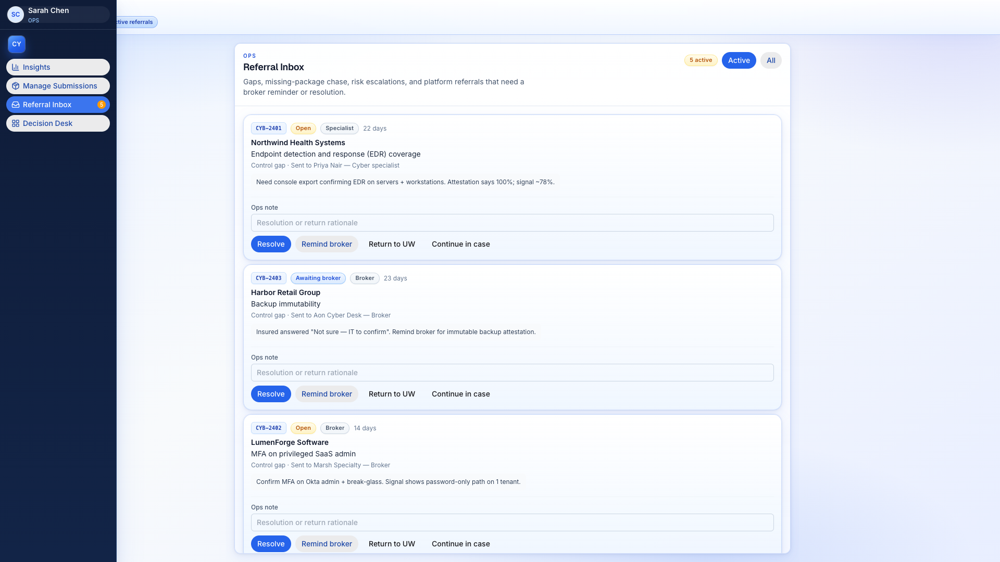
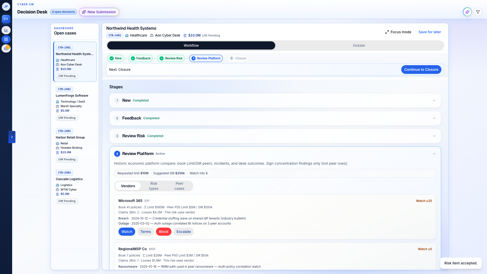
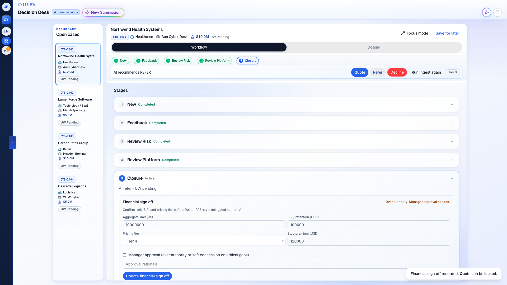

# Cyber UW — Leadership / partner walkthrough email

**Status:** Draft ready to paste  
**Audience:** Leadership and partners  
**Length:** Skim (~4–6 min)  
**Voice:** Quiet confidence + humanized (peer, sparse, specific)

### Assumptions
- Sender: Birlasoft product/design owner writing to leadership and partner contacts
- Fill `[demo URL]` and `[book walkthrough]` before send
- Research claims are secondary synthesis (2026-07-20). No primary UW interview quotes
- Tone: peer expert leave-behind, not pitch deck prose

### Paste tips
- Outlook / Gmail: paste the **Email body** section; insert the five PNGs from `video/public/walkthrough/` as **inline images** (not attachments), matching each beat caption
- If markdown preview is enough for Slack/Teams, image paths below work relative to this file
- Prefer one subject option; put the preheader as the first line of the body if your client supports it

---

## Subject / preheader options

**Option A**  
Subject: Attestation isn’t reality. Cyber UW walkthrough.  
Preheader: Package → gaps → book watch → Quote / Refer / Decline. Twenty minutes if you want the live pass.

**Option B**  
Subject: One workbench. Ops ships. UW binds.  
Preheader: Ideal vs Detected with cite-back. Then closure terms, approve before send.

**Option C**  
Subject: What we built for cyber underwriting (skim)  
Preheader: Soft market speed without silent control concessions. Screenshots from upload to closure.

---

## Email body

Hi,

Cyber underwriting still runs on what the applicant says. Underwriters already know that “EDR everywhere” on a form is not the same as EDR on the endpoints. Soft market pressure makes that gap expensive: more competition, brokers’ market, and real temptation to concede on price, terms, or controls just to move the file.

Specialty desks burn time hunting. One mid-sized specialty underwriter put it plainly: half the day searching for information instead of deciding. The job is not another questionnaire. It is reconcile claim versus signal, then decide and defend.

That is the wedge we built into the Cyber Underwriting Decision Workbench.

### Why this exists

- **Decision-ready dossier, not search.** Package in. Material gaps surfaced. UW opens a case that is ready to judge.
- **Discipline at soft-market speed.** Quote, Refer, or Decline with rationale and an audit trail. No silent control giveaways.
- **Book before bind.** Shared IdP / SaaS / MSP / cloud concentration is visible at quote time, not after the loss.

### Two opportunities most “intake workbenches” miss

1. **Ideal vs Detected is the credibility wedge.** Intake automation alone is a workbench with cyber labels. Attest-versus-signal with cite-back is what partners remember.
2. **Chase early, in Ops.** Resolve or Refer material gaps before UW opens the file. Underwriters should never inherit a blocked case from five inboxes.

We are not Coalition or At-Bay. We do not take insurance risk. We are not a bound-premium engine. Birlasoft ships a configurable IP accelerator: rules, connectors, branding, PAS. Clients personalize.

Tagline we hold: **Agents assist · underwriter binds · every override is explainable**

---

### Walkthrough — package to closure

Five frames. Same spine as the demo.

**1. Package lands**

Messy intake hits the desk. Agents start working the moment the package arrives. Completeness and early signal work begin before anyone digs through email threads.

**2. Ideal vs Detected**

Claim on the left. Detected posture on the right. Every material gap cites its signal. Resolve or Refer here. Not after terms are half-written.

**3. One chase hub**

Remind · Resolve · Return. One hub. Not five inboxes and a week of ping-pong while the submission ages.

**4. Know the book before you bind**

Shared platform spines show up before you set limit and SIR. This is a book-watch alert at quote time, not a catastrophe model rebuild. Partner ratings and cat engines where they belong; we orchestrate the decision record.

**5. Closure terms, then approve before send**

Quote · Refer · Decline. AI can recommend. The underwriter still owns the chip. Limit, SIR, tier guidance, manager cosign when over authority. Then approve before anything pushes to policy admin. No silent re-keying.

---

### What we want from you

If this is useful leave-behind material, the next step is a live pass. About twenty minutes. Same spine.

- Demo: `[demo URL]`
- Book a walkthrough: `[book walkthrough]`

Happy to tailor the room (Ops-led ship/chase, UW-led decide, or partner GTM). Reply with which and we will set it up.

Thanks,  
[Your name]  
Cyber UW · Birlasoft
